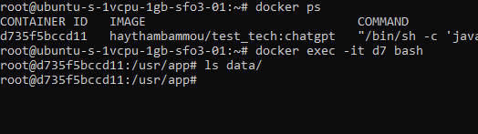
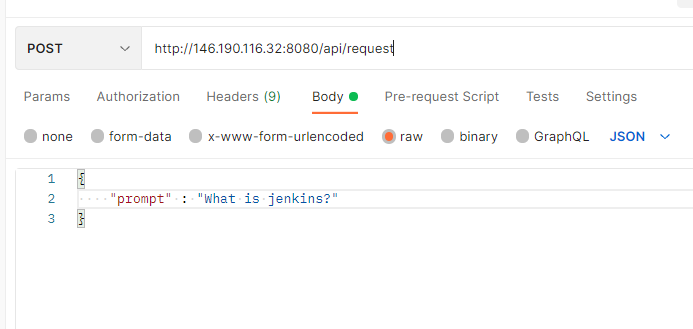
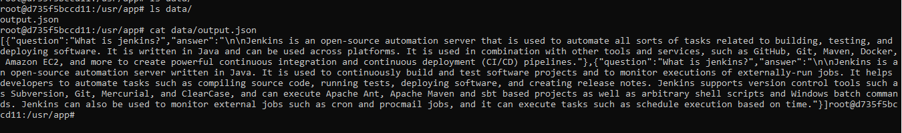
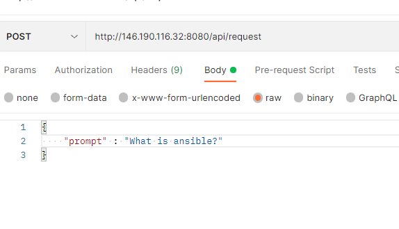
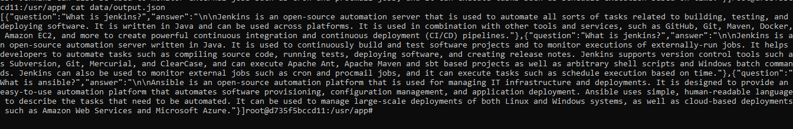
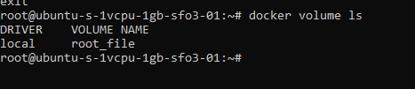
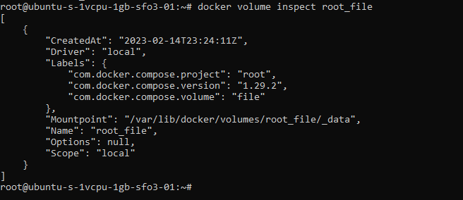
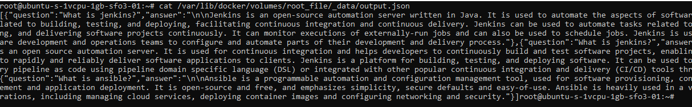

# pour ce test technique premierement partie developpement
premierement on doit donner deux variable d'envirenement file_path et API_KEY
file_path : le path du fichier json de stockage
API_KEY : la clé d'autorisation de chat gpt
j ai cree un REST API qui pour route /api/request prend une requete post 
{
    "prompt" : "la question ?"
} 

alore mon microservice va faire une appelle au REST API de chat gpt il stocke la reponse en format demmandé dans le fichier de stockage

## conteneurisation
on va utiliser docker 

## CI/CD et deployement 
j ai utilisé jenkins avec les étapes suivantes 
1- build de l application et test avec maven 
2- build de l'image et push dans mon repo sur docker hub 
3- cp docker-compose et server.sh dans le serveur de deploiment sur le cloud (j'ai utilisé digital oceans)
4- execution de server.sh dans le serveur
ce script va definir la variable d'envirenment prite de jenkins credentials et la setter sur le serveur
puis remplacer une variable API_KEY dans le fichier docker compose par celle setter sur l env du server 
puis lancer le contenaire 

## server ip : 146.190.116.32

## port : 8080 

# demo

## s'assurer du volume

